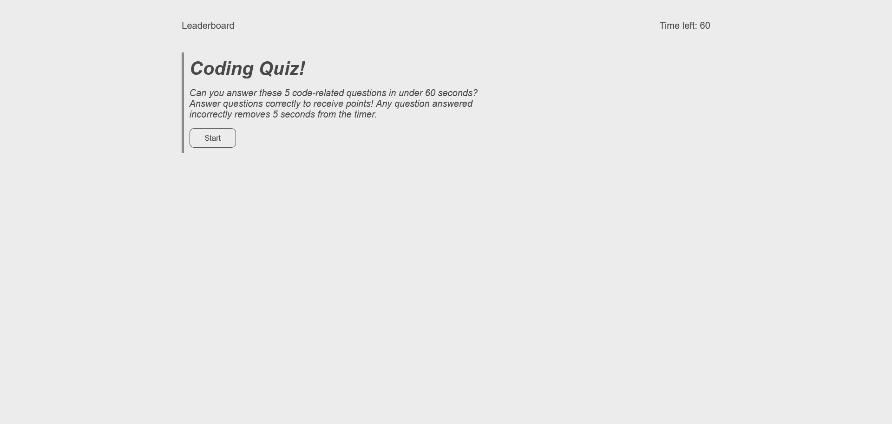

# Code-Quiz

## Description
A simple quiz application that included a leaderboard. The quiz consists of 5 questions, all web-dev related. The user must answer all questions in under 60 seconds. Answering incorrectly removes 5 seconds from the timer. Once the quiz is complete, the user may record their score.

## Links

[Deployed Page](https://staticcloud.github.io/Code-Quiz/)